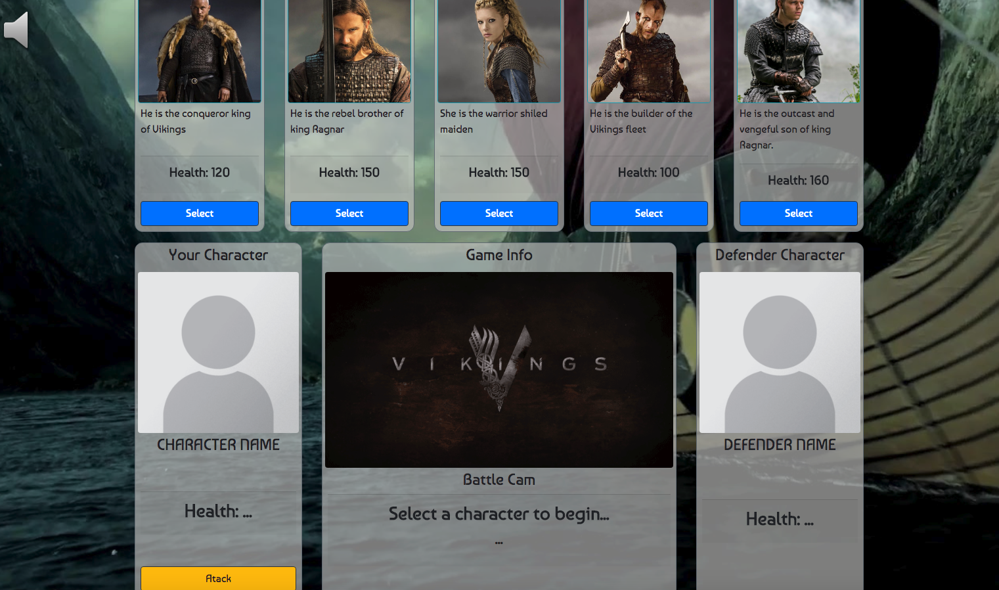
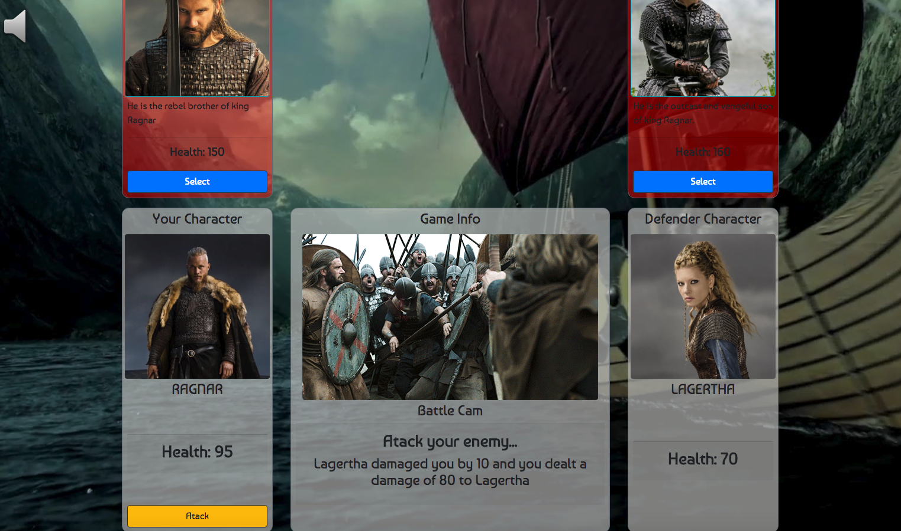

# Vikings RPG Game

This is a Role Playing Game (RPG) based on the History channel series "The Vikings". The show is based on Scandinavian myths and recorded history of Viking tribes who managed to conquer significant portion of Europe and and reached the Mediterranean Sea. THe RPG game is based on internal conflicts between the various members of the Viking tribes.   

## Summary
 In this game you assume the role of a Viking from the given list and try to defeat the remaining characters via multiple attacks. All the characters in the game has a certain number of health points and during the attacks and counter attacks these characters loose these health points. In the case of the selected character the damage per attack increases continuously by a predefined  base damage value (in terms of healt points). The damage of the counter attacks remains (directed towards the selected character) at constant base damage value. This enables the player to beat even the toughest opponents with very high health points and base damage values, given a correct path of opponent selection is followed. 

 ## The layout of the game
 * The game interface is composed of a row (bootstrap) of 5 characters. The cards associated with each character contains the name of the character, a photo, a brief description, initial health points of each character and a button to select the character. 
 * The second row contains the active game components. the selected character, his/her attack button and his/her remaining health appears here in adittion to the name, picture and health of the opponent.
    * The middle console contains directions to play the game, a *"battle cam"* that is updated based on selected characters and the stage of the battle between the characters. This section also provides the information on the amount of damage that each attack caused to the selected character as well as the opponent.
    * A toggle button for playing and pausing an excerpt of the soundtrack of **The Vikings**  is given in the top right-hand-side of the window. This controller is fixed-position so it scrolls with the page.

    

## Game Play (Under the Hood)
The game is composed of mainly 3 stages. These are:
1. Character selection
2. Enemy selection 
3. Attack / counter attack
4. Depending on the outcome of the attacks start from beginning (stage 1) or, in the case of a win, selection of new enemy.

### Specs of the Javascript code
* All the controlling functions in the game are defined in a single object  `vikrpg`.
* The flow of the game is controlled by a variable named `vikrpg.gameStage` which starts with 1 and as the game progresses, incremented by 1. The selection buttons and outcome of attacks changes the stage number, hence making it possible to control the behaviour of the buttons and course of the game. 
* Jquery is used for all modifications of the HTML as well as CSS.

### Flow of the game
1. The Game starts with the game info screen asking you to pick a character for yourself. 
1. As soon as you pick a character, his/her information appears in the _**Your Character**_ section of the second row, while the selected character is removed from the first row, leaving behind all the opponent that will be faced. At this stage the opponents card backgrounds turns red. at this point the stage is incremented.
1. The player than asked to select an enemy. The stage number is used to distinguish between which space is going to be filled after selection (player or defender). With this approach one function can be used to fill both the character and the defender boxes. At the end of this stage the gameStage is incremented and the "attack" stage (3rd stage) begins. This stage assignment makes it possible to avoid reassignemts of enemies and chracter even if the user presses the selection buttons where he/she is supposed to go ahead with the attack. 
1. In the attack phase the player presses the attack key repeatedly until the opponent (or the user him/herself) reaches a healt of 0 or below. If opponent reaches the 0 or sub-zero healt value the player wins this hand and asked to choose another opponent. If the user reaches 0 health or below at the same time (after the final attack) with the opponent, the program automatically declares it as a loss for the player as player cannot fight another enemy. If this happens in the final round, again the it is a loss for the player as the players character did not survibe at the end of the game.The cards of the opponents are made invisible if the player defeats them.

1. Finally, when all the opponents are beaten the gameStage is set to one, a restart button appears in the bottom of the center colmn of the second row, and the game info section asks player to click the restart button if a new game is desired. Similar procedure is also true for a loss before the end of the game. This stage is basically a reset and restart stage where the second row is reset back to its original format (before the start of the game) and the previously selected character is put back to the first row (this is achieved by hiding the associated card in the begining of the gamea and unhiding it at the end using the `.'toggle()` function. The color of the cards are also returned back to the original color.  The game decides if all the opponents are dead based on the number of the invisible cards in the first row. 

